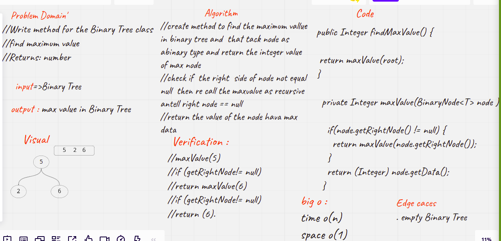

# Challenge Summary
<!-- Description of the challenge -->
### Code Challenge: Class 16

Write the method for the Binary Tree class

find maximum value
Arguments: none
Returns: number
Find the maximum value stored in the tree

## Whiteboard Process
<!-- Embedded whiteboard image -->

## Approach & Efficiency
<!-- What approach did you take? Why? What is the Big O space/time for this approach? -->
2 hours
