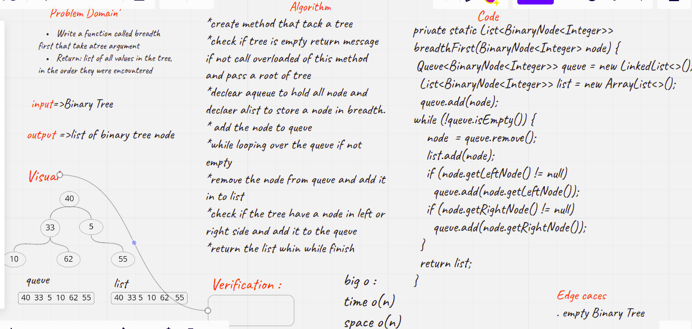

# Challenge Summary
<!-- Description of the challenge -->
### Code Challenge: Class 17

Breadth-first Traversal.

Write a function called breadth first
Arguments: tree
Return: list of all values in the tree, in the order they were encountered

## Whiteboard Process
<!-- Embedded whiteboard image -->

## Approach & Efficiency
<!-- What approach did you take? Why? What is the Big O space/time for this approach? -->
5 hours
