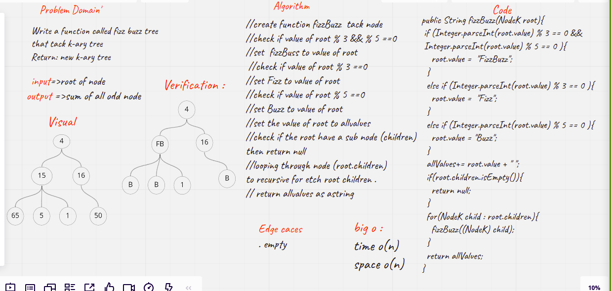

# Challenge Summary
<!-- Description of the challenge -->
### Code Challenge: Class 18

Write a function called fizz buzz tree
Arguments: k-ary tree
Return: new k-ary tree
* If the value is divisible by 3, replace the value with “Fizz”
* If the value is divisible by 5, replace the value with “Buzz”
* If the value is divisible by 3 and 5, replace the value with “FizzBuzz”
* If the value is not divisible by 3 or 5, simply turn the number into a String.

## Whiteboard Process
<!-- Embedded whiteboard image -->

## Approach & Efficiency
<!-- What approach did you take? Why? What is the Big O space/time for this approach? -->
5 hours