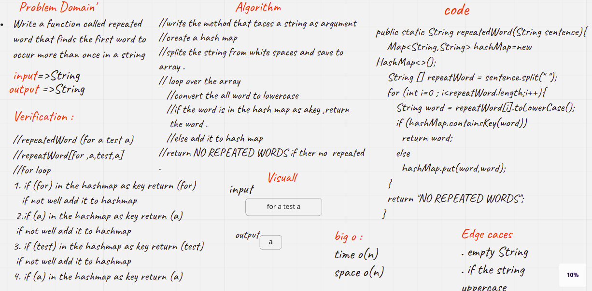

# Code Challenge: Class 31
### Write a function called repeated word that finds the first word to occur more than once in a string
 * Arguments: string
 * Return: string

## Whiteboard Process
<!-- Embedded whiteboard image -->

## Approach & Efficiency
<!-- What approach did you take? Why? What is the Big O space/time for this approach? -->
it take 2 hours

