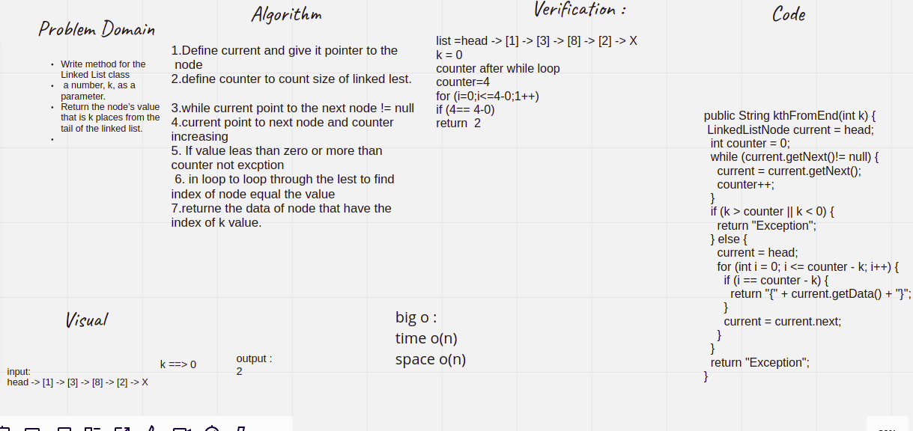

# Challenge Summary
<!-- Description of the challenge -->
kthFromEnd(int) write a method that Return the node’s value that is k (given number) places from the tail of the linked list. 

## Whiteboard Process
<!-- Embedded whiteboard image -->

## Approach & Efficiency
<!-- What approach did you take? Why? What is the Big O space/time for this approach? -->
2 : 4 hour

