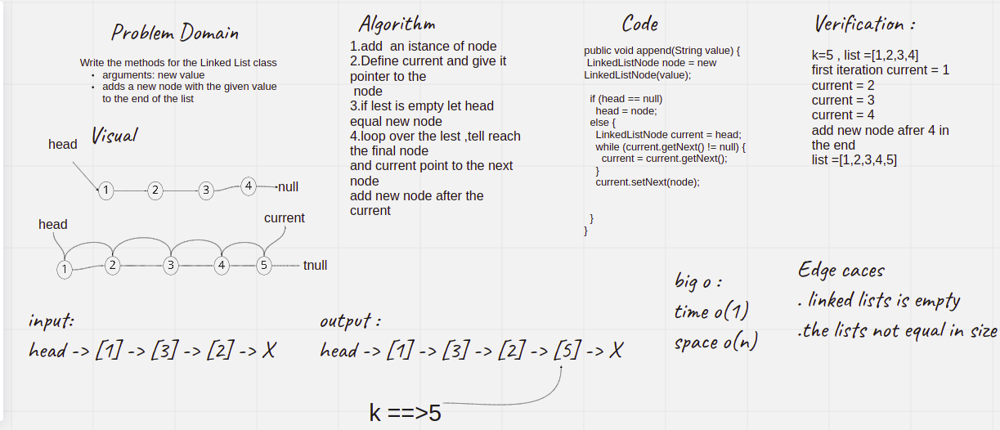
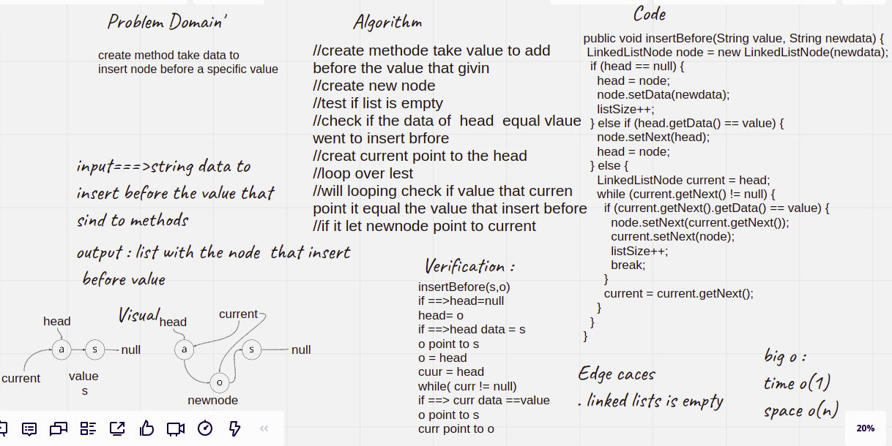
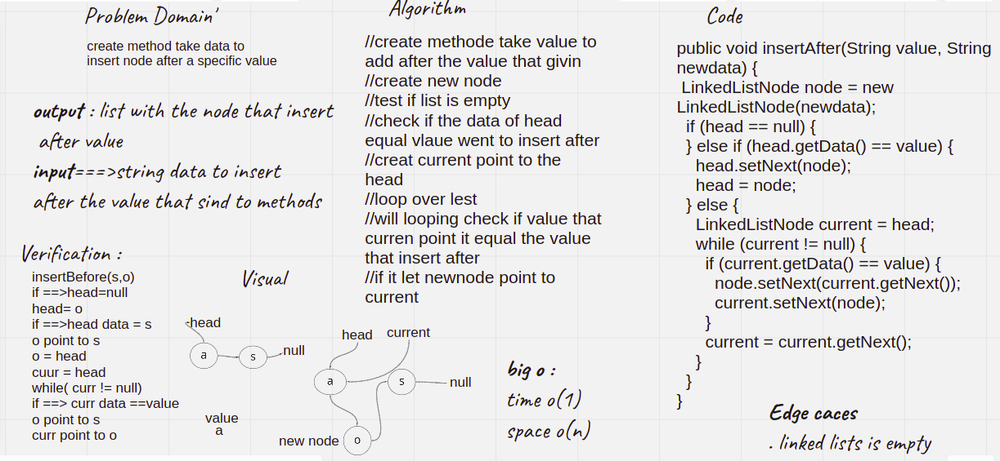

# Challenge Summary
<!-- Description of the challenge -->
Write the methods for the Linked List class
arguments: new value
adds a new node with the given value to the end of the list## Whiteboard Process
<!-- Embedded whiteboard image -->

## Approach & Efficiency
it take 
6 : 9 hour
# Challenge Summary
<!-- Description of the challenge -->
create method take data to
insert node before a specific value## Whiteboard Process
<!-- Embedded whiteboard image -->

## Approach & Efficiency
it take 
6 : 9 hour
# Challenge Summary
<!-- Description of the challenge -->
create method take data to
insert node after a specific value## Whiteboard Process
<!-- Embedded whiteboard image -->

## Approach & Efficiency
it take 
6 : 9 hour
