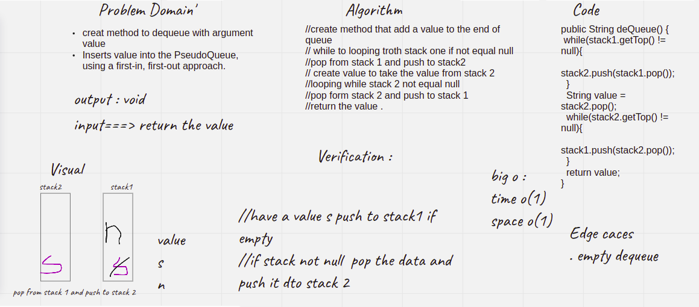

# Challenge Summary
<!-- Description of the challenge -->
### Code Challenge: Class 11
Create a new class called pseudo queue.
Internally, utilize 2 Stack instances to create and manage the queue

* Methods:
enqueue
Arguments: value
Inserts value into the PseudoQueue, using a first-in, first-out approach.
* dequeue
Arguments: none
Extracts a value from the PseudoQueue, using a first-in, first-out approach.h

## Whiteboard Process
<!-- Embedded whiteboard image -->

## Approach & Efficiency
<!-- What approach did you take? Why? What is the Big O space/time for this approach? -->
2 :4 hours
