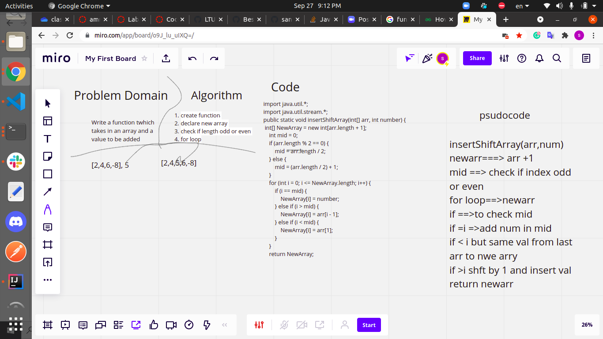

# Shift Array
<!-- Description of the challenge -->
### Write a function  which takes in an array and a value to be added, return an array with the new value added at the middle index.

## Whiteboard Process
<!-- Embedded whiteboard image -->

## Approach & Efficiency

You define an array that takes the values of another array and adds one in the middle.
Check the length of the array whether it is odd or even.
A conditional statement to know the location to which the value is to be entered.
Return the new array