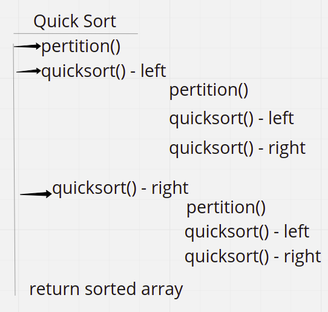
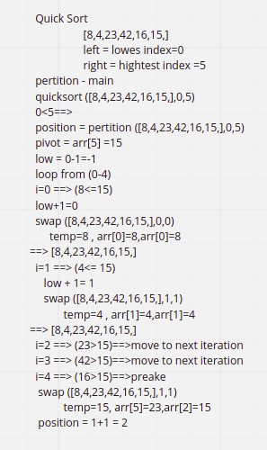
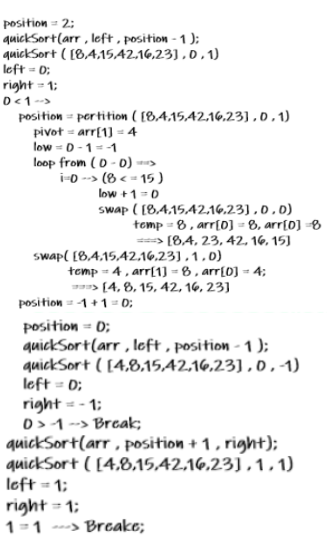
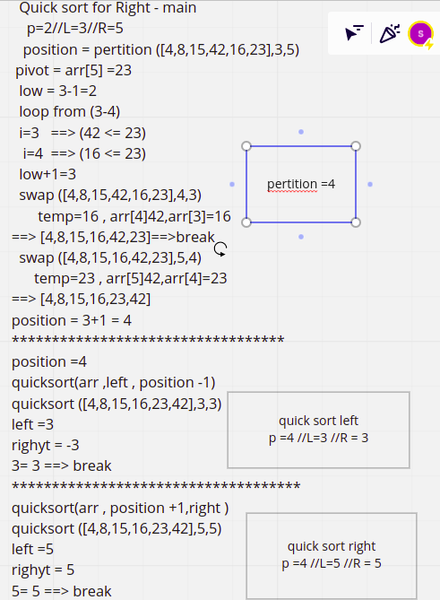

# Quick Sort

QuickSort algorithm picks an element as pivot and partitions the given array around the picked pivot. There are many different versions of quickSort that pick pivot in different ways.

- Always pick first element as pivot.
- Always pick last element as pivot.
- Pick a random element as pivot.
- Pick median as pivot.

The key process in quickSort is `partition()`. Target of partitions is, given an array and an element x of array as pivot, put x at its correct position in sorted array and put all smaller elements (smaller than x) before x, and put all greater elements (greater than x) after x. All this should be done in linear time.

## Pseudocode

```java
ALGORITHM QuickSort(arr, left, right)
    if left < right
        // Partition the array by setting the position of the pivot value
        DEFINE position <-- Partition(arr, left, right)
        // Sort the left
        QuickSort(arr, left, position - 1)
        // Sort the right
        QuickSort(arr, position + 1, right)

ALGORITHM Partition(arr, left, right)
    // set a pivot value as a point of reference
    DEFINE pivot <-- arr[right]
    // create a variable to track the largest index of numbers lower than the defined pivot
    DEFINE low <-- left - 1
    for i <- left to right do
        if arr[i] <= pivot
            low++
            Swap(arr, i, low)

     // place the value of the pivot location in the middle.
     // all numbers smaller than the pivot are on the left, larger on the right.
     Swap(arr, right, low + 1)
    // return the pivot index point
     return low + 1

ALGORITHM Swap(arr, i, low)
    DEFINE temp;
    temp <-- arr[i]
    arr[i] <-- arr[low]
    arr[low] <-- temp
```

## Trace

Sample Array: [8,4,23,42,16,15]

To sort this array using quick sort we will go through these steps shown in the image.


# part 1
while the length of the array is greater than 0 will call pertition method to find position value.


# part 2
will call the quick sort method using position and left value, call the pertition and find the new position, then call quick sort first with position and left value, then with position and right value.
#### quick sort for left -main
p=2, L=0, R =1


 **pertition =0** 
 **Quick sort for left p=0//L=0//R=-1** 
 **Quick sort for Right p=0//L=0//R=1** 
# part 3
will call the quick sort method using position and right value, call the pertition and find the new position, then call quick sort first with position and left value, then with position and right value.


we will get the sorted array, return it.

***Efficency***
Time: O(n)

Space: O(n)