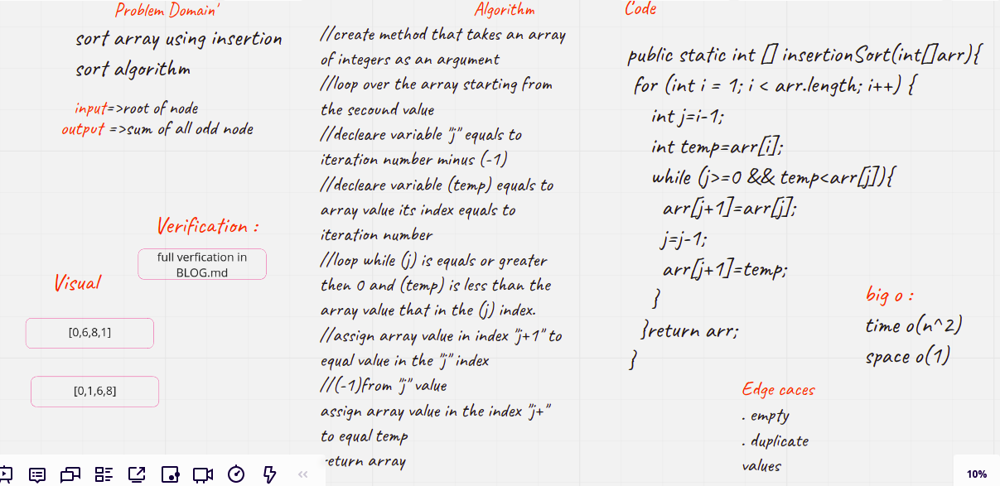
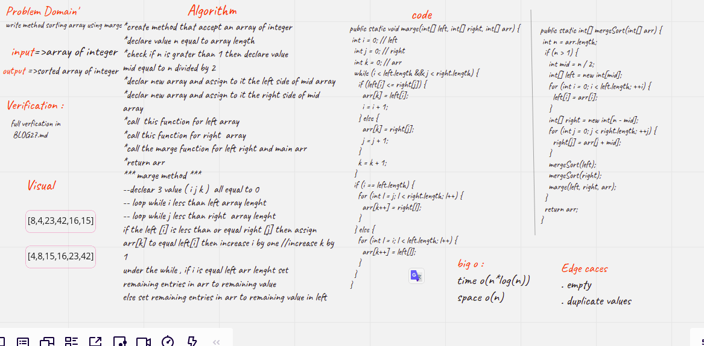

# Challenge Summary
<!-- Description of the challenge -->
### Code Challenge: Class 26

Code Challenge: Class 26

Write a function called Insertion Sort
Arguments: array 
Return: Sorted array

## Full verification [BLOG](BLOG.md)

## Whiteboard Process
<!-- Embedded whiteboard image -->

## Approach & Efficiency
<!-- What approach did you take? Why? What is the Big O space/time for this approach? -->
4 hours
**********************************************
# Challenge Summary
<!-- Description of the challenge -->
### Code Challenge: Class 27

Code Challenge: Class 27
### Merge Sort

trace the algorithm by stepping through the process with the provided sample array. 

Write a function called Insertion Sort
Arguments: array 
Return: Sorted array

## Full verification [BLOG](BLOG27.md)

## Whiteboard Process
<!-- Embedded whiteboard image -->

## Approach & Efficiency
<!-- What approach did you take? Why? What is the Big O space/time for this approach? -->
6 hours