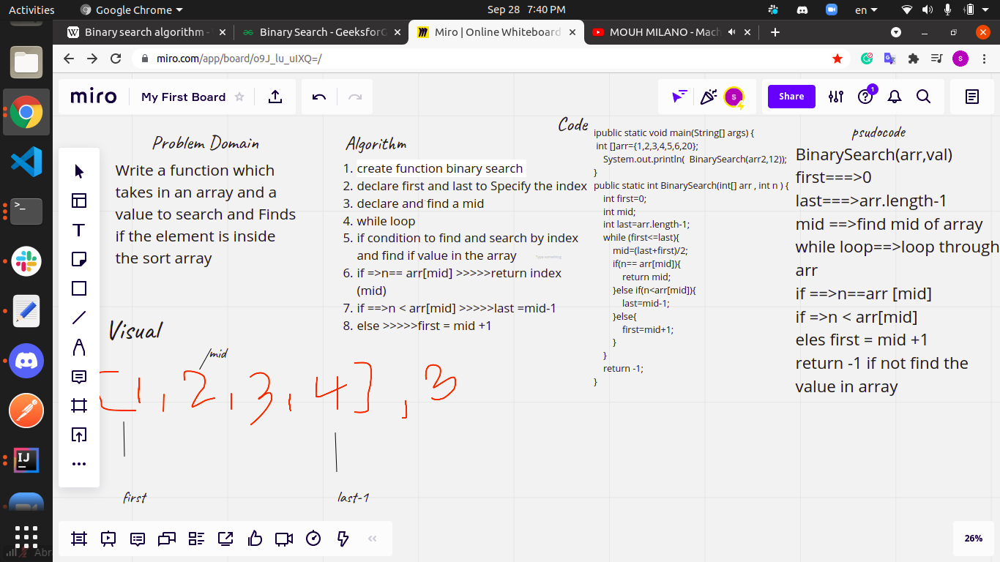

# Binary search
<!-- Description of the challenge -->
### Write a function  which takes in an array and a value to search, return an index with the value  if find it in array and return -1 if not found.

## Whiteboard Process
<!-- Embedded whiteboard image -->

## Approach & Efficiency

You define an array that takes the array and values of and check if the value 
find insid the araay.
find the mid .
A conditional statement to know the location(index) of value if find it in array .
Return -1 if the value not in array.