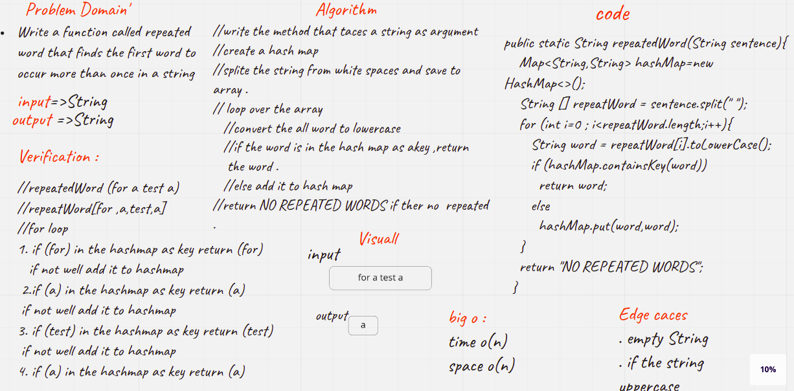
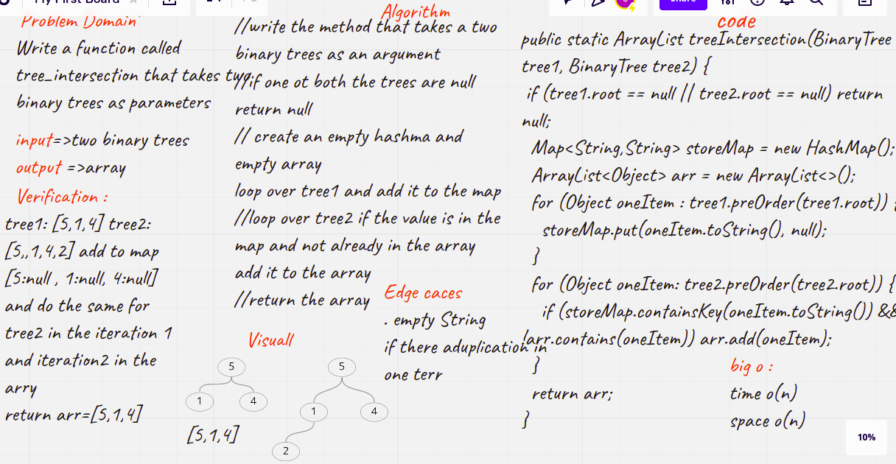
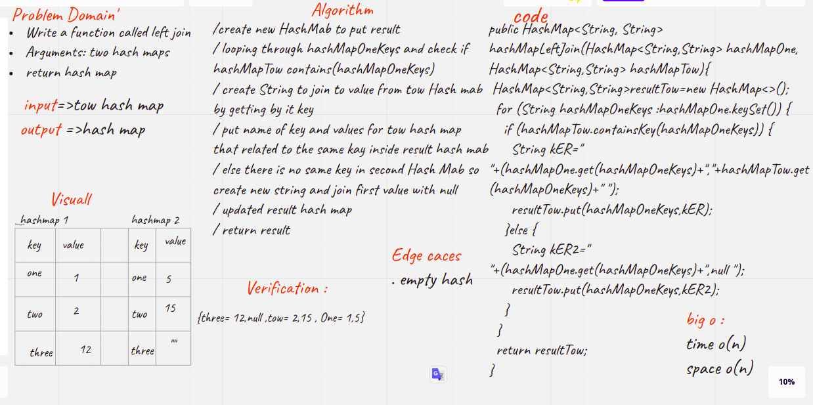

# Code Challenge: Class 30: Hash Table Implementation
Implement a Hashtable Class with the following methods:

* add
  1.Arguments: key, value
  2.Returns: nothing
  3.This method should hash the key, and add the key and value pair to the table, handling collisions as needed.
* get
  1.Arguments: key
  2.Returns: Value associated with that key in the table
    contains
  3.Arguments: key
   Returns: Boolean, indicating if the key exists in the table already.
* hash
  1.Arguments: key
  2.Returns: Index in the collection for that key
********************************************************************************************************

# Code Challenge: Class 31
### repeated word in a book.
### Write a function called repeated word that finds the first word to occur more than once in a string
* Arguments: string
* Return: string

## Whiteboard Process
<!-- Embedded whiteboard image -->

## Approach & Efficiency
<!-- What approach did you take? Why? What is the Big O space/time for this approach? -->
it take 2 hours
***************************************************************************************
#Code Challenge: Class 32

Write a function called tree_intersection that takes two binary trees as parameters.
Using Hashmap implementation as a part of your algorithm, return a set of values found in both trees.
## Whiteboard Process
<!-- Embedded whiteboard image -->

## Approach & Efficiency
<!-- What approach did you take? Why? What is the Big O space/time for this approach? -->
it take 2 hours

*******************************************************************************
#Code Challenge: Class 33
* Write a function called left join
* Arguments: two hash maps
* The first parameter is a hashmap that has word strings as keys, and a synonym of the key as values.
* The second parameter is a hashmap that has word strings as keys, and antonyms of the key as values.
* Return: The returned data structure that holds the results is up to you. It doesn’t need to exactly match the output below, so long as it achieves the LEFT JOIN logic

## Whiteboard Process
<!-- Embedded whiteboard image -->

## Approach & Efficiency
<!-- What approach did you take? Why? What is the Big O space/time for this approach? -->
it take 3 hours
